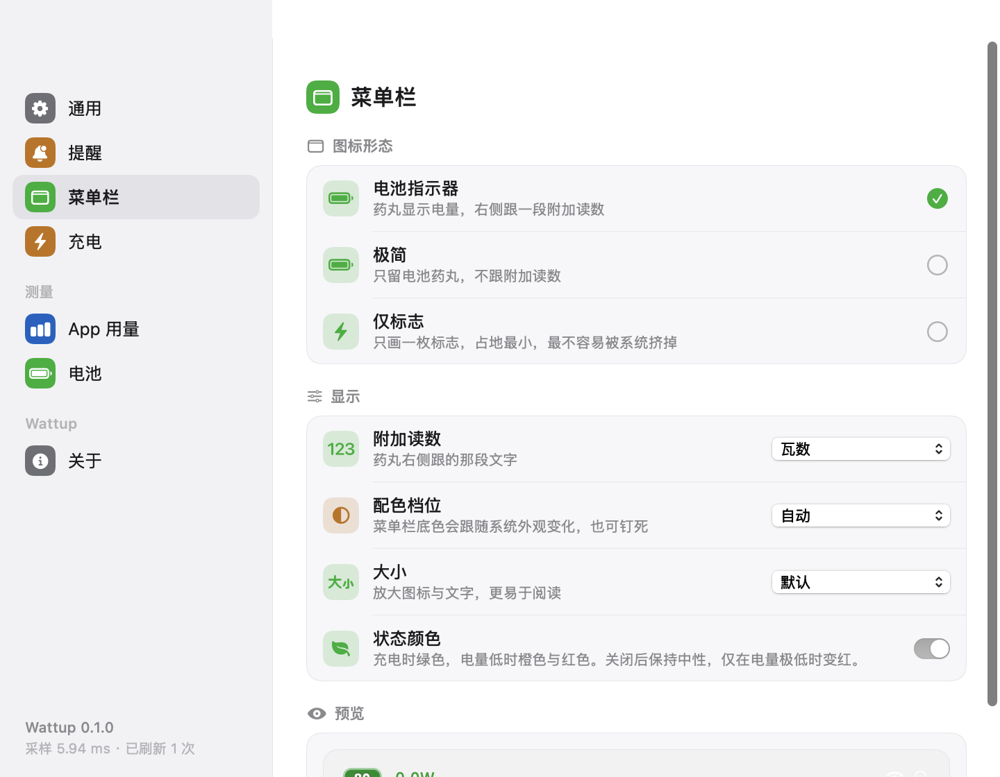
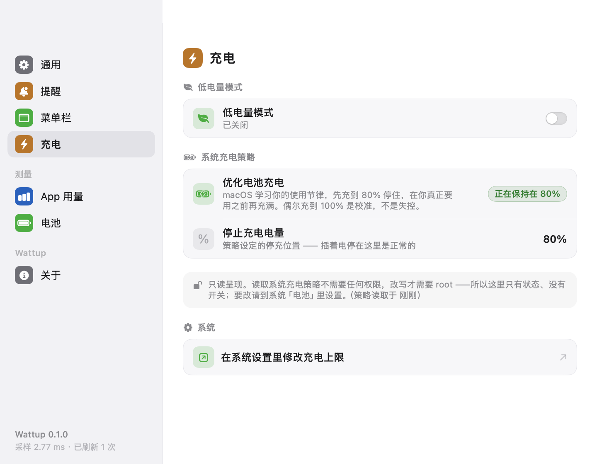

# Wattup

macOS 菜单栏上的充电状态工具。电量、充放电功率、电池温度与健康度、适配器协商档位，
以及当前用户进程的能耗排行 —— 全部本机读取，**零网络请求、零第三方依赖**。

> 名字读作 *what's up*：插着电的这台机器，此刻到底在吃什么电。

<p align="center">
  
  
  <br><br>
  
</p>

---

## 快速开始

```bash
cd Wattup
./build.sh              # 编译 + 组装，产物 .build/Wattup.app
./build.sh --run        # 编译后直接启动
./build.sh --install    # 编译后装到 /Applications 并启动（推荐，之后可从访达直接开）
```

三条命令按需要挑一条即可。`build.sh --help` 看全部选项。

产物 `.build/Wattup.app` 是自包含的，可以直接拖进「应用程序」文件夹。

### 环境要求

| 项 | 要求 |
|---|---|
| 系统 | **macOS 14.0 或更新** |
| 机型 | **需要带电池的 Mac**。无电池机型能跑，但只显示适配器信息 |
| 编译 | Xcode 或 Command Line Tools（Swift 6 工具链）。第三方依赖：无 |
| 已在以下环境验证 | MacBook Air M5（Mac17,3）/ macOS 26.6.2 / Xcode 27.0 |

### 如果 `swift build` 报 sandbox 错误

```
sandbox-exec: sandbox_apply: Operation not permitted
```

这是从终端等受限环境启动 SwiftPM 时的已知问题，**不是代码问题**。`build.sh` 会自动改用
`--disable-sandbox` 重试；手动编译时加同样的参数即可：

```bash
swift build -c release --disable-sandbox
```

---

## 怎么用

启动后**没有 Dock 图标**，只出现在菜单栏。点图标打开弹窗。

### 菜单栏图标

三档形态，在「设置 → 菜单栏」里切换：

| 形态 | 样子 | 说明 |
|---|---|---|
| **电池指示器**（默认） | 绿色药丸 + 电量数字 + 一段附加读数 | 附加读数可选瓦数 / 百分比 / 剩余时长 / 不显示 |
| **极简** | 只留药丸与数字 | 占地更小 |
| **仅标志** | 一枚圆角方块 + 白色闪电 | 占地最小，最不容易被系统挤掉 |

图标颜色跟随状态：**正在充电 / 已充满 / 电量健康为绿**，≤25% 为橙，≤10% 为红。
插着电但确实「适配器顶不住」时才是橙 —— 判定要求有证据（适配器在出力、电量计也没在报充电、
系统不是在按充电上限保电），不会因为插电瞬间读数没跟上就误报。
**闪电只在「正在充电」时出现** —— 已充满、插电但没在充、纯电池供电都不画。
「状态颜色」开关关掉后图标保持中性，只在电量极低时变红。

### 弹窗

英雄卡（大号电量 + 状态芯片 + 进度条 + 采样时间标注）→ 洞察卡 → 整机消耗 / 电池净功率双瓦片 →
四个可折叠分区（功率流向 / 电池 / 充电器 / 能耗排行）→ 底部（低电量模式开关 / 设置… / 退出）。

高度自动封顶在程序坞之上，超出部分滚动。

洞察卡**最多出现一条**，按优先级取第一个成立的：

1. 适配器功率不够用（插着电却在掉电，且适配器确实在出力 —— 见下）
2. **已接电源，但被系统按在某个电量上** —— 只在确实被按住的那一刻出现（接着电源、没有在充电、
   电量已到策略设定的停充点），用来解释「插着电为什么不充」
3. 功率遥测与电池读数不一致（只在**没在充电**时提示；插电后遥测块 60 秒才刷新一次，
   那一拍的"打架"是暂时现象，不当故障报）
4. 功率来自推导口径（没读到 `PowerTelemetryData`）

### 设置面板

点弹窗底部的「设置…」进入（应用没有独立的菜单，设置只在弹窗里）。7 个分栏：

| 分栏 | 能改什么 |
|---|---|
| 通用 | 开机自动启动、通知外观（提醒气泡尺寸、屏幕边缘光晕）、查看最近采样耗时、恢复默认设置 |
| 提醒 | 插拔电源提示开关 + 停留时长；电量偏低 / 适配器功率不足 / 电池高温 三个告警 + 各自阈值 |
| 菜单栏 | 图标形态、附加读数、配色档位（自动 / 浅 / 深）、大小、状态颜色，带实时预览 |
| 充电 | 低电量模式开关；系统充电策略（只读展示，见下） |
| App 用量 | 能耗排行显示条数、当前采样窗口、权限边界说明 |
| 电池 | 只读实时数据：电量、温度、健康度、循环、满充 / 设计容量、主板侧输入、电芯电压 |
| 关于 | 版本、数据来源、已知限制、退出 |

设置存在 `UserDefaults`（域 `app.wattup.menubar`），改了立刻生效。

<p align="center">
  
</p>

「充电」分栏里的**系统充电策略**是只读的：读出系统当前在用的充电策略、停止充电电量、以及这条策略
是什么时候读的。**读取这个文件不需要任何权限**（它就是普通可读的），所以这里只呈现状态、不放开关；
要改请点那一行的入口去系统「电池」里改。

### 提示胶囊

插拔电源、以及三类告警（电量偏低 / 适配器功率不足 / 电池高温）会在**屏幕正上方居中**弹一枚胶囊。

- 插拔提示**延迟约 1.4 秒**再弹，等功率读数稳定下来，避免弹出一个还没读准的 `0.0 W`。
- 三类告警**每次启动最多各弹一次**，避免在临界值附近反复弹。
- 走应用自己的面板，**不经过系统通知中心，因此不需要通知权限**。

外观在「设置 → 通用 → 通知外观」里改：**提醒气泡尺寸**（紧凑 / 默认 / 宽松）与**屏幕边缘光晕**（关闭 / 默认 / 强烈）。
「屏幕边缘光晕」这一个档位同时决定两处观感：贴着胶囊外缘扩散的一圈同色柔光，
以及**菜单栏正下方、横跨整屏的一条渐隐光带**（默认 90 pt 高、强烈 150 pt，底部渐隐到 0，不抢点击）。
同一处带一张**按当下读数渲染的实时预览**（渲染的就是真弹出来那套视图），
以及一个「预览通知」按钮可以直接试弹一条看真实效果。

<p align="center">
  
</p>

屏幕边缘光带（默认档 / 强烈档，截自 1470×956 的内建屏）：

<p align="center">
  
  <br>
  
</p>

---

## 安装与管理

### 装到「应用程序」

```bash
./build.sh --install            # 等价于 ditto .build/Wattup.app /Applications/Wattup.app
```

或者手动：把 `.build/Wattup.app` 拖进访达的「应用程序」文件夹。

**开机自启要求应用在 `/Applications`**，否则 `SMAppService` 注册会失败
（设置面板里会如实报出系统返回的状态，而不是只留一个勾）。

### 运行与退出

```bash
open .build/Wattup.app                             # 启动
.build/Wattup.app/Contents/MacOS/Wattup            # 直接跑（可带参数，见下）
pkill -f "Wattup.app/Contents/MacOS/Wattup"        # 退出
```

弹窗底部也有一个整条的「退出 Wattup」。

### 卸载

```bash
rm -rf /Applications/Wattup.app                         # 删应用
defaults delete app.wattup.menubar                      # 清掉设置（可选）
```

### 拷到别的 Mac 会被拦

产物是 **ad-hoc 签名**的，不是 Developer ID。通过 AirDrop / 下载传到别的机器后
Gatekeeper 会拦截，把它拖出隔离区即可：

```bash
xattr -dr com.apple.quarantine /Applications/Wattup.app
```

### 命令行诊断入口

产物里的同一个二进制兼作诊断工具。全部参数都是**诊断用途**，正常使用不需要。

```bash
APP=.build/Wattup.app/Contents/MacOS/Wattup

# —— 状态与界面 ——
$APP --verify-statusitem               # 状态项是否真的落在菜单栏，并给出落位判定
$APP --selfcheck-statusitem-verdict    # 只核对落位判定逻辑本身（跟屏幕是否点亮无关）
$APP --verify-popover-fit              # 内容自然高度 / 可用高度 / 预计窗口下沿 vs 程序坞顶

# —— 电源与告警 ——
$APP --watch-power-events --watch-seconds=120   # 真机拔插验证：事件实时打到 stderr
$APP --selfcheck-power-event           # 不拔电源线也能验证插拔判定（首次不发 / 重复不发 / 翻转各发一次）
$APP --toast=plug|unplug|low|discharge|temp     # 弹一次提示看版式；不给截图路径就真弹 6 秒
$APP --lpm                             # 低电量模式能否读取 / 写入

# —— 自身开销 ——
$APP --perf [--perf-iters=N]           # 采样各阶段耗时分解，折算成「每小时 CPU 毫秒」
```

除 `--watch-power-events` 需要自己指定 `--watch-seconds` 外，其余参数跑完都会自行退出
（`--toast` 会在屏幕上真弹约 6 秒再退出）。

---

## 数据来源与限制

三个数据源，全部是系统框架、**不需要 root、不需要内核扩展**：

| 来源 | 提供什么 |
|---|---|
| `AppleSmartBattery` IORegistry | 功率遥测（适配器输入 / 整机负载 / 电池净功率）、电压电流、温度、电芯、健康与寿命 |
| `IOPSCopyPowerSourcesInfo`（公开 API） | 电量、充电状态、剩余时间、电池健康状况 |
| `proc_pid_rusage(RUSAGE_INFO_V6)` | 进程能耗 |

功率有两套独立口径可以互证：

```
SystemPowerIn − SystemLoad = BatteryPower        （遥测口径）
Voltage × Amperage          = BatteryPower        （物理口径）
```

### 三点需要知道的行为

1. **功率与电量每 60 秒刷新一次。** 这是电池固件的更新节律。界面会标注「采样于 N 秒前」，
   数字不跳动是正常的，不是卡住了。
2. **进程能耗排行只覆盖当前用户的进程。** 系统权限边界严格等价于用户归属：同 uid 可读、异 uid 一律被拒。
   面板里有常驻说明，并列出无权读取的进程数。
3. **进程能耗合计只占整机功耗的一小部分（约 8%）。** GPU、神经网络引擎、显示与内存的功耗不归属到进程，
   所以排行只用于**相对排序**，不能当绝对瓦数看。

### 已知限制

| 限制 | 原因 | 现状 |
|---|---|---|
| **充电上限只能看不能改** | 读取策略不需要权限，改写需要 root | 设置面板里显示为只读状态（策略 / 停止充电电量 / 读取时间），**不给点了没反应的开关**；要改跳系统「电池」 |
| **「适配器功率不足」宁可少报也不误报** | 判据要求「适配器确实在出力」等证据；拿不到证据时不作结论 | 系统按充电上限保电时的放电、插电瞬间读数还没跟上、充电中的口径打架，都不报。**正在充电永远不会被标成橙色** |
| **低电量模式一键切换可能失败** | 写入需要 root，非 root 下会被系统拒绝 | 读取正常；写入尽力而为 + 回读确认，失败时直说系统限制并打开系统「电池」设置，**不弹管理员密码框** |
| **跨用户进程能耗不可读** | 系统权限边界 | 界面常驻说明 |
| **未提供 Mac App Store 版本** | 沙盒会切断跨进程能耗读取 | 需自行编译，见「快速开始」 |

### 常驻开销

一个菜单栏工具会 7×24 小时跑在电池上，所以空闲开销也当作一项规格。**不打开弹窗时**
（也就是绝大多数时间），实测 CPU 占用约 **0.01%**，空闲唤醒为每分钟个位数 ——
没打开弹窗的时候它基本处于睡眠状态。

（瞬时功率读数会随机器整体活动明显浮动，不适合当固定规格看；CPU 占用与空闲唤醒次数是稳定的。）

---

## 故障排查

### 应用在跑，但菜单栏上看不到图标

八成不是代码问题。macOS 26 的菜单栏被刘海切成三段，**新建的状态项会被追加到状态区最左端，
塞不下就丢进刘海左侧区域 —— 那里不会被绘制，但 `isVisible` 仍返回 `true`、窗口也真实存在**。

本应用对此做了处理（设置 `autosaveName` 并播种
`NSStatusItem Preferred Position Wattup`），让系统把它放进刘海右侧的可见区。若仍然看不到：

```bash
$APP --verify-statusitem               # 看 occlusionState.visible 是否为 true，以及窗口落在哪个 x
$APP --selfcheck-statusitem-verdict    # 只想核对判定逻辑本身，跑这个
```

- **先看自检开头的「会话状态」一行。** 锁屏 / 显示器休眠 / 屏保期间整条菜单栏都不绘制，
  此时 `occlusionState.visible` 必为 `false`、菜单栏 `layer=25` 窗口数必为 `0` ——
  都是预期值，不是缺陷。自检会把这种情况判成「○ 无法判定」而不是「✗ 缺陷」，
  并给出一条不依赖屏幕亮度的静态证据：窗口坐标 x 是否落在刘海右侧可用区。
- `occlusionState.visible = false` 且屏幕正常，或 x 落在刘海区 → 才是真的落位问题。
- 如果机器上还装着别的同类工具（比如 Juicy），**先确认你看的是哪一个图标** ——
  用「杀掉本应用前后各截一张做差分」定位，凭颜色认容易认错。

### 数字长时间不动

正常。电量计 60 秒才刷新一次（见「三点需要知道的行为」）。任何读同一数据源的工具都受限于这个刷新率。

### 插着电，却停在 80% 不动

**这不是故障，是 macOS 的「优化电池充电」。** 它学习你的作息，先充到 80% 停住，
在你真正要用之前再充满；偶尔充到 100% 是校准，不是失控。

本应用把这条策略读出来给你看：

- **设置 → 充电** → 显示当前策略、停止充电电量、以及这条策略是什么时候读的；
- 插着电被按住的**那一刻**，弹窗顶部会出一条「已接电源，但在 80% 停住了」的说明。

数据来自 `/Library/Preferences/com.apple.powerd.charging.plist`（root 可写、但**全局可读**，
读它不需要任何权限）。想改就点「设置 → 充电 → 在系统设置里修改充电上限」，
或直接打开「系统设置 → 电池」。

> 注意区分两件事：这个文件说的是**系统被配置成要做什么**，不是**此刻正在做什么**。
> 所以应用只在「接电 + 没在充电 + 电量已到停充点」三条同时成立时才说"正在保持"。

### 弹窗被程序坞挡住 / 太高

弹窗高度是按「状态项下沿 − 程序坞上沿」实时算的。如果异常，打一份几何自检：

```bash
$APP --verify-popover-fit
```

会输出内容自然高度、可用高度、预计窗口下沿与程序坞顶的对比，并给一行 ✅ / ❌ 判定。

### 拷到别的 Mac 打不开

ad-hoc 签名 + Gatekeeper 拦截，见上面「拷到别的 Mac 会被拦」。

### 开机自启注册不上

应用必须放在 `/Applications` 目录。设置面板「通用」里会显示系统返回的真实状态
（未注册 / 未找到 / 等待批准），不是本地假装的布尔值。

---

更详细的设计说明与实测数据见 [`docs/mac-charging-menubar-design.md`](docs/mac-charging-menubar-design.md)。
