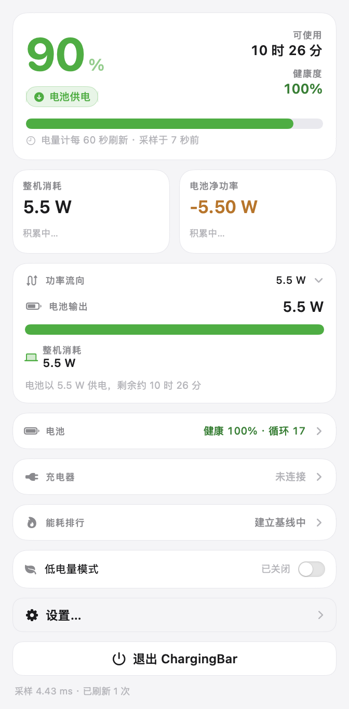
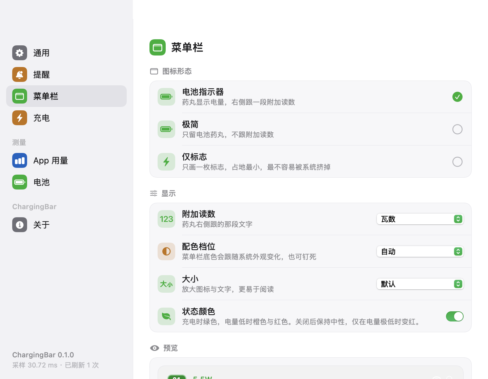
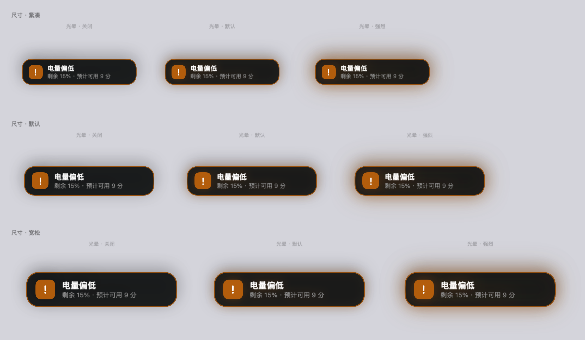
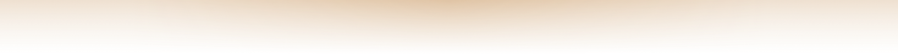

# Wattup

macOS 菜单栏上的充电状态工具。电量、充放电功率、电池温度与健康度、适配器协商档位，
以及当前用户进程的能耗排行 —— 全部本机读取，**零网络请求、零第三方依赖**。

> 名字读作 *what's up*：插着电的这台机器，此刻到底在吃什么电。

<p align="center">
  
  
  <br><br>
  
</p>

---

## 快速开始

```bash
cd Wattup
./build.sh              # 编译 + 组装，产物 .build/Wattup.app
./build.sh --run        # 编译后直接启动
./build.sh --install    # 编译后装到 /Applications 并启动（推荐，之后可从访达直接开）
```

三条命令按需要挑一条即可。`build.sh --help` 看全部选项（另有 `--preview`、`--clean`）。

产物 `.build/Wattup.app` 是自包含的，可以直接拖进「应用程序」文件夹。

### 环境要求

| 项 | 要求 |
|---|---|
| 系统 | **macOS 14.0 或更新**（用到 `.symbolEffect` / `.contentTransition` / `.animation(.smooth)`） |
| 机型 | **需要带电池的 Mac**。无电池机型能跑，但只显示适配器信息 |
| 编译 | Xcode 或 Command Line Tools（Swift 6 工具链）。第三方依赖：无 |
| 实测环境 | MacBook Air M5（Mac17,3）/ macOS 26.6.2 (25G83) / Xcode 27.0 / Apple Swift 6.4 |

> 包的 `swiftLanguageMode` 设为 **v5**（见 `Package.swift`），用 Swift 6 工具链编译，不是 Swift 6 语言模式。

### 如果 `swift build` 报 sandbox 错误

```
sandbox-exec: sandbox_apply: Operation not permitted
```

这是从终端/受限环境启动 SwiftPM 时的已知问题，**不是代码问题**。`build.sh` 会自动改用
`--disable-sandbox` 重试；手动编译时加同样的参数即可：

```bash
swift build -c release --disable-sandbox
```

---

## 怎么用

启动后**没有 Dock 图标**（`LSUIElement = true`），只出现在菜单栏。点图标打开弹窗。

### 菜单栏图标

三档形态，在「设置 → 菜单栏」里切换：

| 形态 | 样子 | 说明 |
|---|---|---|
| **电池指示器**（默认） | 绿色药丸 + 电量数字 + 一段附加读数 | 附加读数可选瓦数 / 百分比 / 剩余时长 / 不显示 |
| **极简** | 只留药丸与数字 | 占地更小 |
| **仅标志** | 一枚圆角方块 + 白色闪电 | 占地最小，最不容易被系统挤掉 |

图标颜色跟随状态：电量健康为绿，≤25% 为橙，≤10% 为红；插着电但电池在净放电（适配器顶不住）也是橙。
**闪电只在"正在充电"时出现** —— 已充满、插电但没在充、纯电池供电都不画。
「状态颜色」开关关掉后图标保持中性，只在电量极低时变红。

### 弹窗

英雄卡（大号电量 + 状态芯片 + 进度条 + 采样时间标注）→ 洞察卡 → 整机消耗/电池净功率双瓦片 →
四个可折叠分区（功率流向 / 电池 / 充电器 / 能耗排行）→ 底部（低电量模式开关 / 设置… / 退出）。

高度自动封顶在程序坞之上，超出部分滚动。

### 设置面板

点弹窗底部的「设置…」进入（应用没有独立的菜单，设置只在弹窗里）。7 个分栏：

| 分栏 | 能改什么 |
|---|---|
| 通用 | 开机自动启动、**通知外观**（提醒气泡尺寸、屏幕边缘光晕、实时预览、试弹）、查看最近采样耗时、恢复默认设置 |
| 提醒 | 插拔电源提示开关 + 停留时长；电量偏低 / 适配器功率不足 / 电池高温 三个告警 + 各自阈值 |
| 菜单栏 | 图标形态、附加读数、配色档位（自动/浅/深）、大小、状态颜色，带实时预览 |
| 充电 | 低电量模式开关；充电上限（见「已知限制」） |
| App 用量 | 能耗排行显示条数、当前采样窗口、权限边界说明 |
| 电池 | 只读实时数据：电量、温度、健康度、循环、满充/设计容量、主板侧输入、电芯电压 |
| 关于 | 版本、数据来源、已知限制、退出 |

设置存在 `UserDefaults`（域 `app.wattup.menubar`），改了立刻生效。

### 提示胶囊

插拔电源、以及三类告警（电量偏低 / 适配器功率不足 / 电池高温）会在**屏幕正上方居中**弹一枚胶囊。

- 插拔提示**晚 1.4 秒**才弹，因为插上电源的瞬间功率读数还没稳定 —— 抢那一两秒只会弹出一个 `0.0 W`。
- 三类告警**每次启动最多各弹一次**，避免在临界值附近反复弹。
- 走应用自己的面板，**不经过系统通知中心，因此不需要通知权限**。

外观在「设置 → 通用 → 通知外观」里改：**提醒气泡尺寸**（紧凑 / 默认 / 宽松）与**屏幕边缘光晕**（关闭 / 默认 / 强烈）。
「屏幕边缘光晕」这一个档位同时决定两处的观感：贴着胶囊外缘扩散的一圈同色柔光，
以及**菜单栏正下方、横跨整屏的一条渐隐光带**（默认 90 pt 高、强烈 150 pt，底部严格渐隐到 0，不抢点击）。
同一处带一张**按当下读数渲染的实时预览**（渲染的就是真弹出来那套视图，不是另画一张示意），
以及一个「预览通知」按钮可以直接试弹一条看真实效果。

<p align="center">
  
</p>

屏幕边缘光带（默认档 / 强烈档，截自 1470×956 的内建屏，图为光带区域本身）：

<p align="center">
  
  <br>
  
</p>

---

## 使用编译产物

### 装到「应用程序」

```bash
./build.sh --install            # 等价于 ditto .build/Wattup.app /Applications/Wattup.app
```

或者手动：把 `.build/Wattup.app` 拖进访达的「应用程序」文件夹。

**开机自启要求应用在 `/Applications`**，否则 `SMAppService` 注册会失败
（设置面板里会如实报出系统返回的状态，而不是只留一个勾）。

### 运行与退出

```bash
open .build/Wattup.app                                  # 启动
.build/Wattup.app/Contents/MacOS/Wattup            # 直接跑（可带参数，见下）
pkill -f "Wattup.app/Contents/MacOS/Wattup"        # 退出
```

弹窗底部也有一个整条的「退出 Wattup」。

### 卸载

```bash
rm -rf /Applications/Wattup.app                         # 删应用
defaults delete app.wattup.menubar                      # 清掉设置（可选）
```

### 拷到别的 Mac 会被拦

产物是 **ad-hoc 签名**的，不是 Developer ID。通过 AirDrop / 下载传到别的机器后
Gatekeeper 会拦截，把它拖出隔离区即可：

```bash
xattr -dr com.apple.quarantine /Applications/Wattup.app
```

正式分发需要 Developer ID 签名 + 公证，替换 `build.sh` 里那一步 `codesign`。

### 命令行自检入口

产物里的同一个二进制兼作自检工具。全部参数都是**诊断用途**，正常使用不需要。

```bash
APP=.build/Wattup.app/Contents/MacOS/Wattup

# —— 数据与几何 ——
$APP --dump                                    # 打印所有解析出的字段，核对字段映射
$APP --verify-statusitem                       # 状态项是否真的落在菜单栏（occlusionState + 全部 layer=25 窗口）
                                               # 锁屏/显示器休眠时会自报「无法判定」并给出静态落位证据，不会误报成缺陷
$APP --selfcheck-statusitem-verdict            # 状态项可见性判定的三条分支各跑一遍（不依赖屏幕是否点亮）
$APP --verify-popover                          # 合成点击 → 弹窗链路，打印窗口 frame 与 contentSize
$APP --verify-popover-fit [--sections=...]     # 内容自然高度 / 可用高度 / 预计窗口下沿 vs 程序坞顶
$APP --lpm                                     # 低电量模式读写能力自检（并排打印两种读法做交叉验证）

# —— 自身开销 ——
$APP --perf [--perf-iters=N]                   # 采样各阶段耗时分解，折算成「每小时 CPU 毫秒」
                                               # 改了轮询/采样逻辑后跑一次，防止能耗悄悄回升

# —— 事件与告警 ——
$APP --selfcheck-power-event                   # 合成快照验证插拔判定（首次不发 / 重复不发 / 翻转各发一次）
$APP --watch-power-events --watch-seconds=120  # 真机拔插验证：事件实时打到 stderr
$APP --toast=plug|unplug|low|discharge|temp [--toast-shot=x.png] [--glow-shot=x.png]
                                               # 弹一次提示核版式 + 打印位置裁定；不给截图路径就真弹 6 秒
                                               # --glow-shot 另存屏幕边缘光带（光晕「关闭」档不会建面板，会报 snapshot failed，属预期）

# —— 界面自渲染截图（不依赖屏幕录制权限）——
$APP --ui-preview [--warmup=N] [--snapshot=x.png] [--snapshot-delay]
                                               # 整幅弹窗；--warmup 先攒 N 秒历史曲线再截
$APP --settings [--settings-pane=menuBar|alerts|general|charging|usage|battery|about] \
                [--settings-shot=x.png]        # 设置面板；--settings-via-button 走弹窗按钮那条入口
$APP --icon-strip=x.png [--menubar=...]        # 图标状态对照图（核对闪电只在充电时出现）
$APP --toast-strip=x.png [--appearance=...]    # 提醒外观对照图（尺寸 × 光晕 九种组合）

# —— 外观与状态覆盖 ——
$APP --menubar=batteryIndicator|minimal|mark   # 临时改形态，不写盘（兼容旧值 wattage|percentage|iconOnly）
$APP --appearance=dark|light                   # 强制外观，用于双外观截图核对
$APP --sections=all|none|reset|flow,energy     # 预设分区展开状态 ← 会写盘，截完记得 --sections=reset
```

注意两点：

- `--sections=` **会写进 UserDefaults**（其余外观类参数都不写盘），截图脚本结束时要
  `--sections=reset` 还原出厂默认。
- **除 `--ui-preview` 外，上面每个参数跑完都会自行退出**（自检脚本要的行为）；
  `--ui-preview` 不带 `--snapshot=` 时会留着预览窗口不退出 —— 传了 `--snapshot=` 才会截完就退。
  只有 `--menubar=` / `--appearance=` 这类纯覆盖参数会正常常驻在菜单栏。

---

## 项目结构

```
Wattup/
├── build.sh                    # 唯一构建入口：编译 → 组装 .app → 签名（版本号也在这里）
├── Package.swift               # SwiftPM 清单，单可执行目标，无依赖
├── .gitignore
│
├── Sources/Wattup/
│   ├── App/
│   │   ├── main.swift          # 入口。刻意不用 SwiftUI MenuBarExtra（见下）
│   │   ├── AppDelegate.swift   # 状态项、弹窗尺寸、命令行自检入口都在这里
│   │   ├── PerfCommand.swift   # --perf 的分阶段耗时分解（自身能耗用）
│   │   └── DumpCommand.swift   # --dump 的字段打印
│   ├── Model/
│   │   ├── BatterySnapshot.swift  # 一次采样的值类型，全部派生量都是计算属性
│   │   ├── PowerModel.swift       # 状态聚合层：轮询、发布、插拔判定、告警判定
│   │   └── AppSettings.swift      # 设置模型，直接读写 UserDefaults
│   ├── Samplers/
│   │   ├── RegistrySampler.swift      # IORegistry AppleSmartBattery 全量字段
│   │   ├── PowerSourceSampler.swift   # 公开 API（IOPSCopyPowerSourcesInfo）补齐
│   │   ├── ProcessEnergySampler.swift # proc_pid_rusage 差分算进程能耗
│   │   ├── PowerSourceMonitor.swift   # 电源插拔事件
│   │   ├── LowPowerMode.swift         # 低电量模式：进程内 API 读 + 系统设置深链
│   │   └── SessionState.swift         # 锁屏/显示器休眠/屏保判据（自检据此区分误报）
│   └── UI/
│       ├── PopoverView.swift    # 弹窗（PopoverContent 供测量高度，PopoverView 带滚动）
│       ├── SettingsWindow.swift # 设置面板：分栏 + 行/组/单选/下拉/说明块组件
│       ├── StatusToast.swift    # 屏幕正上方居中的提示胶囊
│       ├── MenuBarIcon.swift    # 自绘状态项图标（唯一渲染出口）+ 配色纯函数
│       ├── CollapsibleCard.swift
│       ├── Glyphs.swift         # 环形/条形进度、图标芯片等自绘件
│       ├── Theme.swift          # 配色令牌 JB，全部跟随系统外观
│       └── Formatters.swift     # 数值格式化（W / V / °C / 时长）
│
├── resources/AppIcon.icns      # 应用图标（已生成，随仓库提供）
├── tools/make_icon.py          # 重新生成上面那个图标
└── docs/
    ├── mac-charging-menubar-design.md   # 完整设计方案 + 全部实测证据 + 踩过的坑
    ├── probe/                           # 10 个探针脚本（复现实测数字用，不参与构建）
    └── shots/                           # 界面截图与自检对照图
```

**为什么不用 `MenuBarExtra`**：在手工组装的 SwiftPM `.app` bundle 下实测状态栏项不会出现。
改用 `NSStatusItem` + `NSPopover`，界面仍然是 SwiftUI，通过 `NSHostingController` 承载。

---

## 数据来源与硬约束

三个数据源，全部是系统框架、**不需要 root、不需要内核扩展**：

| 来源 | 提供什么 |
|---|---|
| `AppleSmartBattery` IORegistry | `PowerTelemetryData` 功率遥测（适配器输入 / 整机负载 / 电池净功率）、电压电流、温度、电芯、健康与寿命 |
| `IOPSCopyPowerSourcesInfo`（公开 API） | 电量、充电状态、剩余时间、电池健康状况 |
| `proc_pid_rusage(RUSAGE_INFO_V6)` | 进程能耗（`ri_energy_nj` 差分） |

功率有两套独立口径可以互证：

```
SystemPowerIn − SystemLoad = BatteryPower        （遥测口径）
Voltage × Amperage          = BatteryPower        （物理口径）
```

### 三条硬约束（实测，界面里都标注了）

1. **功率与电量每 60 秒才刷新一次。** 实测 `AppleSmartBattery` 的 `UpdateTime` 与 `Amperage`
   在 150 秒观测里只变了 3 次，间隔精确为 60、60 秒。所以界面会写「采样于 N 秒前」，
   数字不跳动是正常的，不是卡住了。
2. **进程能耗只能读到与当前应用同一个用户（uid）的进程。** 实测权限边界严格等价于用户归属：
   同 uid 全部可读、异 uid 全部被拒，零例外。排行只覆盖当前用户进程，面板里常驻说明。
3. **进程能耗合计只占整机功耗的约 8%。** GPU / ANE / 显示 / 内存的功耗不归属到进程，
   所以排行只能做**相对排序**，界面里不把它当绝对瓦数。

采样开销（可作性能预算）：IORegistry 全量 0.29 ms / 适配器详情 0.061 ms /
`proc_pid_rusage` 遍历 550 进程 1.09 ms。完整的「一次采样」耗时用 `--perf` 量。

---

## 自身能耗

一个常驻菜单栏工具会 7×24 小时跑在用户的电池上，所以「自己花多少电」和「功能对不对」
同等重要。本项目为此做了三件事，每一件都是先量、再改、再量。

### 量：`--perf` 把开销拆到阶段

```bash
./.build/Wattup.app/Contents/MacOS/Wattup --perf
```

它把每个阶段按**真实代码路径**单独计时，再乘各自的节律，折算成「每小时花多少毫秒 CPU」。
菜单栏工具的能耗几乎就是「固定成本 × 频率」，只看一个总量没法知道该优化哪一项。

优化前的分解（弹窗关闭常态，即 99.9% 的时间）：

| 阶段 | ms/次 | 次/时 | ms/时 | 占比 |
|---|---|---|---|---|
| 低电量模式读取（起 `pmset` 子进程） | 73.8 | 60 | **4429** | **83%** |
| 全进程能耗扫描 | 4.06 | 120 | 487 | 9% |
| 每轮询周期固定成本（7 项） | 0.544 | 720 | 392 | 7% |
| **合计** | | | **5308** | |

### 改：三处，按收益排序

1. **低电量模式读取：把 `pmset` 子进程换成进程内公开 API。**
   旧实现解析 `pmset -g` 的输出，**实测每次 82.8 ms**（fork + exec + dyld 把 pmset 和它依赖的
   IOKit 全加载一遍）。改用 `ProcessInfo.isLowPowerModeEnabled`：**实测 < 0.001 ms**，
   读数与 `pmset -g` 一致（`--lpm` 会把两种读法并排打出来，可随时复核）。
   再挂上 `NSProcessInfoPowerStateDidChange` 通知，连"每 60 秒问一次"都省了 —— 状态变了系统会叫我们。
   **「不问」比「问得更便宜」更彻底。**

2. **状态项只在「影响观感的输入」变化时才重绘。**
   `refreshStatusItem()` 要新建 `NSImage`、重设 `length`、重设 `attributedTitle` 与 `toolTip`，
   每一步都让状态栏窗口重新合成。而电量计 60 秒才更新一次、主轮询是 5 秒一次 ——
   无条件重绘意味着 **12 次里有 11 次在重画一模一样的像素**。
   现在先用一个「渲染签名」（形态 / 尺寸 / 明暗 / 电量 / 充电 / 外接 / 附加读数 / tooltip）
   比一下，一样就直接不碰 AppKit。实测单次成本 0.124 ms → 0.005 ms。

3. **只服务于展示的 `@Published` 指标，没有界面可见时不写。**
   `secondsSinceGaugeUpdate` 是个每秒都在变的派生值（"采样于 N 秒前"），
   每轮都写它等于每轮都让 SwiftUI 的 `objectWillChange` 触发一次、整棵视图树重算 body。
   现在判据是「弹窗 / 预览窗口 / 设置面板**任一**可见」—— 用闭包从 AppDelegate 拉取，
   而不是发通知推状态（拉取永远与真实可见性一致，通知要维护状态机、漏一条就永久偏移）。

顺带把能耗扫描也改便宜了：原先枚举 550 个进程时**挨个解析可执行路径**（`proc_pidpath`
每次要拷最多 1024 字节），而现在绝大多数进程在两次扫描之间没有任何能耗增量。
改成「先确认有增量，再解析身份」后，扫描从 ~4–5 ms 降到 ~3 ms；同时把弹窗关闭时的
扫描间隔从 30 秒放宽到 60 秒（与电量计刷新同拍，搭同一次唤醒，不额外叫醒 CPU）。

### 再量：受控 A/B

直接测「当前正在运行的那个实例」是不可靠的 —— 弹窗开着时轮询 1 秒/次、扫描 2 秒/次，
关着时 5 秒 / 60 秒，**同一份二进制差好几倍**。所以用 `docs/probe/ab_energy.sh`
自己拉起被测进程、静置 15 秒、弹窗保持关闭，各测多轮：

| 指标（每 60 秒窗口） | 优化前 | 优化后 |
|---|---|---|
| **空闲唤醒次数** | **14 – 15 次** | **2 次** |
| CPU 时间 | 9.7 – 60.2 ms（波动极大） | 3.5 – 4.3 ms（稳定） |
| 平均功率 | 6.8 – 54.2 mW（波动极大） | 1.4 – 2.8 mW |
| `--perf` 折算同步开销 | 5308 ms/时 | 494 – 591 ms/时 |

两点要如实说明：

- **优化前的 CPU 与功率波动很大**（同一份二进制，不同轮次能差 5 倍以上），
  因为它把成本集中在「每 60 秒起一个子进程」这种突发上。突发对续航比均匀消耗更不友好 ——
  每次都要把 CPU 从深空闲态拉出来。优化后三个数字都变得平稳，这本身就是收益。
- **空闲唤醒次数是最可信的那一项**：两轮 A/B 完全一致（14/15 → 2/2），
  它也是决定笔记本待机功耗的关键量。这一项从 14–15 次/分降到 2 次/分。

`docs/probe/` 下的 `pid_energy.c`（单进程能耗 + 唤醒次数）与 `ab_energy.sh`（受控 A/B）
可以随时复现上表。改完轮询 / 采样逻辑后应当跑一次 `--perf` 与 A/B，防止能耗悄悄回升。

---

## 已知限制

| 限制 | 原因 | 现状 |
|---|---|---|
| **充电上限不能设** | 需要写 SMC，必须由 root helper 完成 | 设置面板里标为「规划中」并写明原因，**不给点了没反应的开关** |
| **低电量模式一键切换失败** | `pmset -b lowpowermode` 需要 root，`sudo -n` 不可用 | 读取正常；写入尽力而为 + 回读确认，失败时直说系统限制并打开系统「电池」设置，**不弹管理员密码框** |
| 跨用户进程能耗不可读 | 系统权限边界 | 界面常驻说明，并列出无权读取的进程数 |
| 不做 Mac App Store | 沙盒预计会切断跨进程能耗读取 | 走 Developer ID 公证 + Homebrew Cask（`ProcessEnergySampler` 设计为可摘除模块） |

---

## 故障排查

### 应用在跑，但菜单栏上看不到图标

八成不是代码问题。macOS 26 的菜单栏被刘海切成三段，**新建的状态项会被追加到状态区最左端，
塞不下就丢进刘海左侧区域 —— 那里不会被绘制，但 `isVisible` 仍返回 `true`、窗口也真实存在**。

本项目的处理：设置 `autosaveName`，并在创建状态项之前播种
`NSStatusItem Preferred Position Wattup`；系统据此把它放进刘海右侧的可见区。

自查：

```bash
$APP --verify-statusitem      # 看 occlusionState.visible 是否为 true，以及窗口落在哪个 x
$APP --selfcheck-statusitem-verdict   # 只想核对判定逻辑本身，跑这个（跟屏幕状态无关）
```

- `occlusionState.visible = false` 或 x 落在刘海区 → 属于上述落位问题。
- **先看自检开头的「会话状态」一行**。锁屏 / 显示器休眠 / 屏保期间整条菜单栏都不绘制，
  此时 `occlusionState.visible` 必为 `false`、菜单栏 `layer=25` 窗口数必为 `0` ——
  都是预期值，不是缺陷。自检会把这种情况判成「○ 无法判定」而不是「✗ 缺陷」，
  并附带一条不依赖屏幕亮度的静态证据：窗口坐标 x 是否落在刘海右侧可用区。
  （踩过：凌晨锁屏跑自检拿到 false，白查了一轮覆盖区/autosaveName 落位逻辑。）
- 如果机器上还装着别的同类工具（比如 Juicy），**先确认你看的是哪一个图标** ——
  用「杀掉本应用前后各截一张做差分」定位，凭颜色认容易认错。
- 无效手段（已排除）：`killall SystemUIServer`、收紧 `NSStatusItemSpacing`、缩到 `squareLength`。

### 数字长时间不动

正常。电量计 60 秒才刷新一次（见「三条硬约束」）。想要秒级真值的工具同样受限于这个刷新率，
只是它们没说。

### 弹窗被程序坞挡住 / 太高

弹窗高度是按「状态项下沿 − 程序坞上沿」实时算的，并已扣掉 `NSPopover` 自身 26 pt 的外框。
如果仍异常，打一份几何自检：

```bash
$APP --verify-popover-fit
```

会输出内容自然高度、可用高度、预计窗口下沿与程序坞顶的对比，并给一行 ✅/❌ 判定。

### 拷到别的 Mac 打不开

ad-hoc 签名 + Gatekeeper 拦截，见上面「拷到别的 Mac 会被拦」。

### 开机自启注册不上

应用必须放在 `/Applications` 目录。设置面板「通用」里会显示系统返回的真实状态
（未注册 / 未找到 / 等待批准），不是本地假装的布尔值。

---

## 开发

```bash
# 改版本号：build.sh 顶部的 VERSION（会同时写进 Info.plist 与「关于」面板）

# 重新生成应用图标（resources/AppIcon.icns 已随仓库提供，改配色时才需要重跑）
pip3 install pillow
python3 tools/make_icon.py resources/AppIcon.icns

# 双外观截图核对
./build.sh
APP=.build/Wattup.app/Contents/MacOS/Wattup
$APP --ui-preview --appearance=light --snapshot=docs/shots/my_light.png
$APP --ui-preview --appearance=dark  --snapshot=docs/shots/my_dark.png
```

代码约定与已踩过的坑集中在 `docs/mac-charging-menubar-design.md`，
里面每条实测结论都附了可复现命令；需要复现实测数字时用 `docs/probe/` 里的探针脚本。

设计上的两条取向，改动时请一并遵守：

- **能自渲染就不截屏**（不依赖屏幕录制权限），**能一次画全所有状态就不等真机状态变化**。
- **做不到的能力不放进界面当开关**，宁可少一个开关，也不要一个点了没反应的开关。
